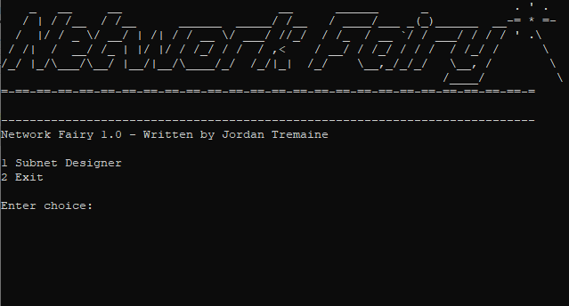
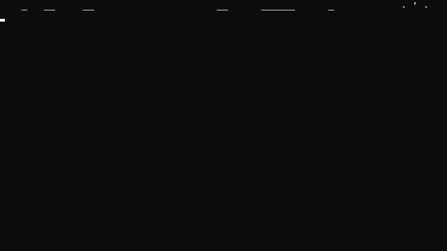
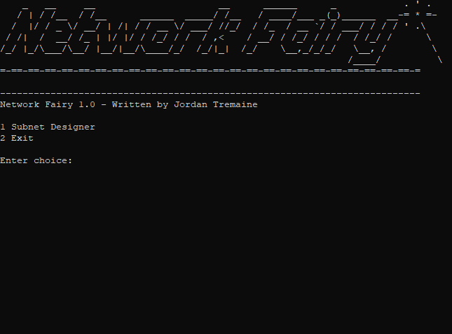
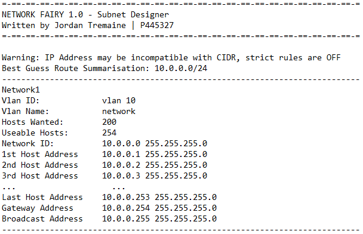

# Network Fairy - Subnet Designer

## Introduction

Network Fairy 1.0 is tool for IPv4 subnet design. Enter a network ID address, choose the number of subnets you want, and the number of hosts required for each subnet. The fairy will return the best facts to the console, or a text file if you choose.

## Contents
* [Requirements](#requirements)
* [Setup](#setup)
* [Operation](#operation)
* [Bugs](#bugs)
* [Build](#build)
* [Rules](#rules)
* [Licenses](#licenses)
* [Credits](#credits)

## Requirements
* Windows 10 & Server 2016
* 10MB Disk space
* 3MB Memory
* 1.4Ghz Processor

## Setup

1. Download the 'Network Fairy 1.0.zip' file.

2. Unzip the file in the directory of your choosing

3. Run 'Network Fairy 1.0.exe'

## Operation

### Design a Subnet

Enter 1 for Subnet Design

    1

Enter your network ID

    10.0.0.0

Enter number of subnets required

    5

Enter a Vlan ID and name

    Vlan 10 -sales

Enter the numbers of hosts required

    200

### Write the result to a .txt file

Enter 1 to save output to text

    1

Enter a name for your file

    testsave1

The program will open the .txt immediately, no need to append .txt to end.

## Bugs

Doing the following will cause the program to crash

- Entering words instead of numbers when selecting the number of subnets required.
- Entering words instead of numbers when selecting number of hosts wanted.
- Writing to a .txt file in a directory you do not have write permissions for.

## Build

**Language**

Python 3.7

**Integrated Development Environment**

PyCharm Community Edition 2018.3.4

**Packaged using**

[auto-py-to-exe](https://pypi.org/project/auto-py-to-exe/)

**Ascii Art made with**

[Ascii Generator](http://www.network-science.de/ascii/)

**Gifs made with**

[ScreenToGif](https://www.screentogif.com/)

## Rules

1. Network Fairy 1.0 only designs Variable Length Subnet Masks from /16 to /30.
2. Network Fairy 1.0 limits the amount of subnets to 100.

## Licenses

Network Fairy is made availiable under the [MIT License](https://opensource.org/licenses/mit-license.php)

## Credits

To all the tools other people made, that I just used.

Jordan Tremaine, 2019.

